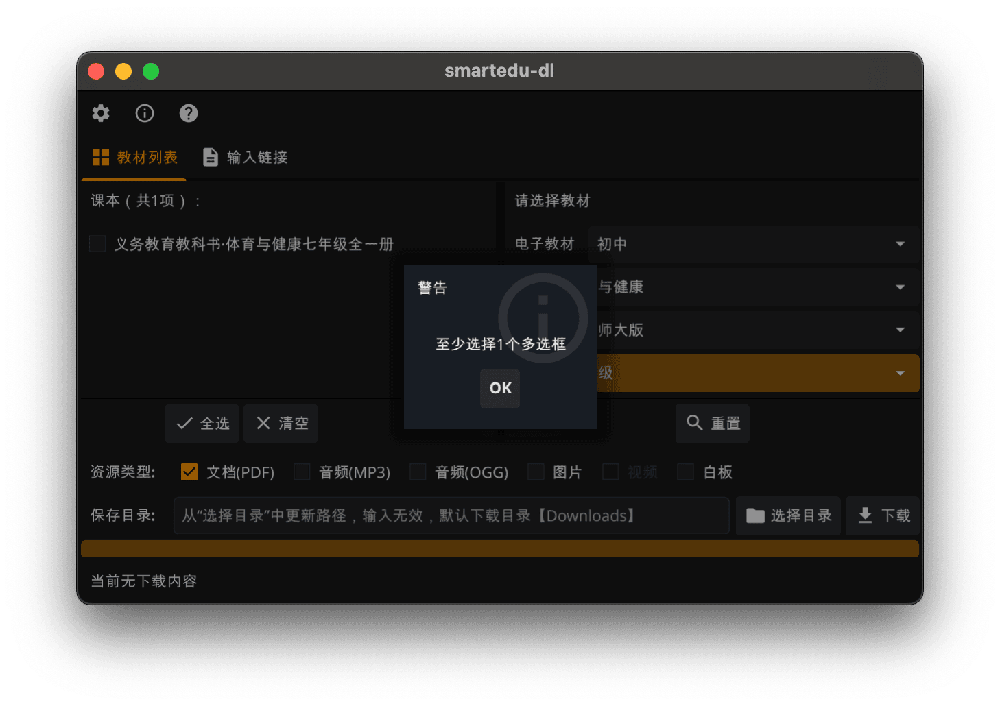
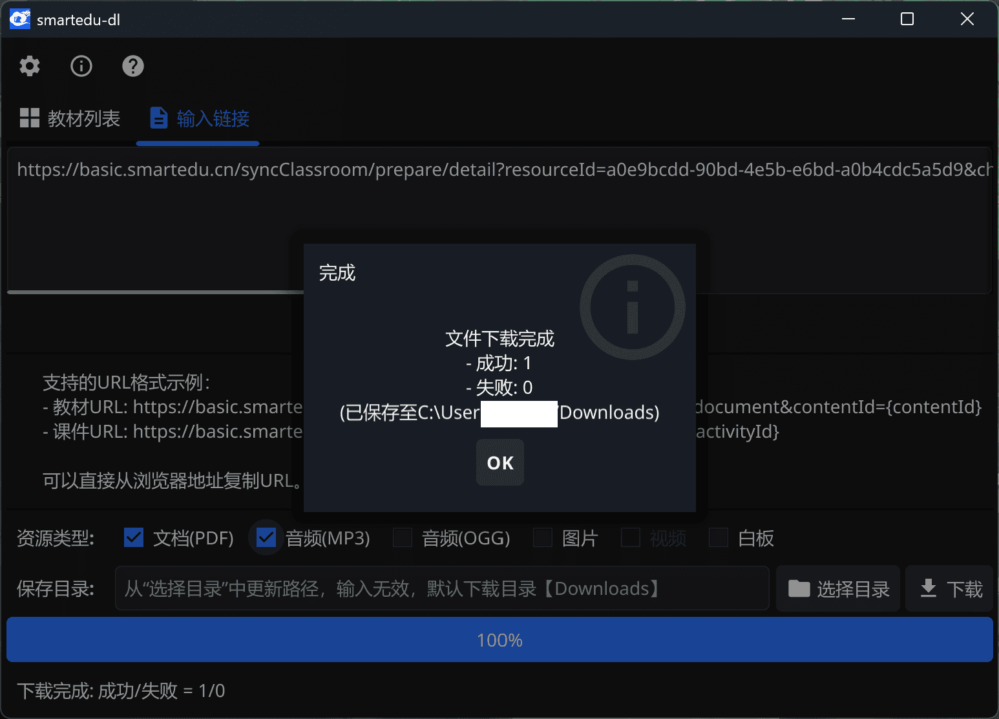
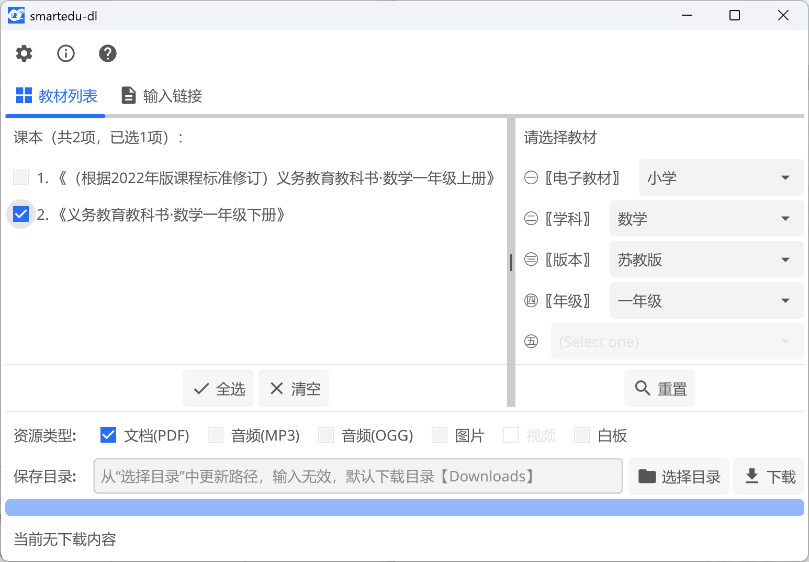

# smartedu-dl (`go`)


> 智慧教育平台资源下载工具（`go`实现版，基于 fyne 框架 GUI 版本）

## 📝 功能说明

主要支持`smartedu.cn`教材、课件（PDF 格式）下载存储。

### 🖥️ 截图

| 平台    | 页面     | 暗黑                       | 明亮                        |
| ------- | -------- | -------------------------- | --------------------------- |
| macos   | 输入链接 |  |  |
|         | 教材列表 |  |  |
|         |          |                            |
| windows |          |    |    |
|         |          |                            |
| linux   |          |  |  |

### ⚡️ 更新

- [x] 链接输入列表下载(`v0.1.x`)
- [x] 教材查询列表下载(`v0.2.x`)
    - 支持登录信息配置（devtools/network选择pdf文件找到Request Headers中`x-nd-auth`参数）
    - 增加日志统计（结果保存在`log-smartedudl.txt`）
    - 增加备用解析链接
    - 已知问题：
      - 部分音频下载可能失败（包括已配置登录信息）；
      - 非登录状态部分资源可能下载失败或下载的是旧版教材；
      - 新增备用解析，可能导致下载同一个下载多个对应PDF（可能不完全相同）。

## 👷 开发

```shell
# go语言开发环境

go mod tidy
go run main
```

## 🌐 相关项目

- 旧版（python）
  - [hantang/smartedu-dl](https://github.com/hantang/smartedu-dl)

- 类似项目
  - [happycola233/tchMaterial-parser](https://github.com/happycola233/tchMaterial-parser)
  - [52beijixing/smartedu-download](https://github.com/52beijixing/smartedu-download)
  - 智慧教育平台电子教材下载器 <https://www.52pojie.cn/thread-1891126-1-1.html>
  - [cjhdevact/FlyEduDownloader](https://github.com/cjhdevact/FlyEduDownloader)

- 图标：修改自<https://www.smartedu.cn/>
