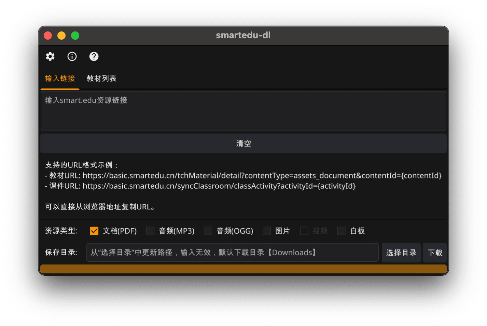
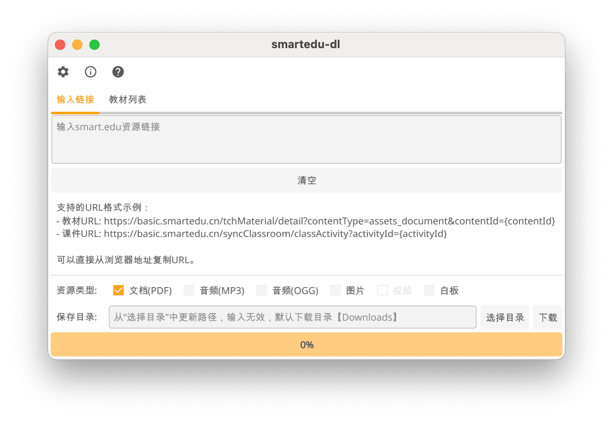

# smartedu-dl (`go`)

> 智慧教育平台资源下载工具（`go`实现版，仅基于 fyne 框架 GUI 版本，正在进行中）

## 📝 功能说明

主要支持`smartedu.cn`教材、课件（PDF 格式）下载存储。

### 更新

- [x] 链接输入列表下载
- [ ] 教材查询列表下载

### 截图

| 平台  | 暗黑                     | 明亮                      |
| ----- | ------------------------ | ------------------------- |
| macos |  |  |

## 相关项目

- [smartedu-dl](https://github.com/hantang/smartedu-dl)
