# smartedu-dl (`go`)


> [!NOTE]
> 智慧教育平台资源下载工具（`go`实现版，基于 **fyne** 框架 GUI 版本）。
>
> 主要页面：教材页面（课本PDF、音频）、课程教学页面（课件、教学视频等）、中小学语文示范诵读库（语文课文音频，可直接下载）等。

> [!TIP]
> 新增js脚本，可在浏览器 **Tampermonkey** 等插件中使用（仅支持教材课本页面下载课本PDF，仍需要登录）。
>
> - 脚本安装链接 [greasyfork.org | SmartEdu 教材下载（PDF课本）](https://greasyfork.org/zh-CN/scripts/578069-smartedu-教材下载-pdf课本)
> - 源代码 [gist.github.com | smartedu-dl.user.js](https://gist.github.com/hantang/81e8715dfc1d20760c4c268ee63d5a1b)


## 📝 功能说明

主要支持`smartedu.cn`教材、课件（PDF 格式、视频、音频）、语文诵读音频等下载存储。

### 🖥️ 截图

> 仅供参考，新版界面可能已调整。

| 平台    | 页面     | 暗黑                       | 明亮                        |
| ------- | -------- | -------------------------- | --------------------------- |
|         | 课程包 | 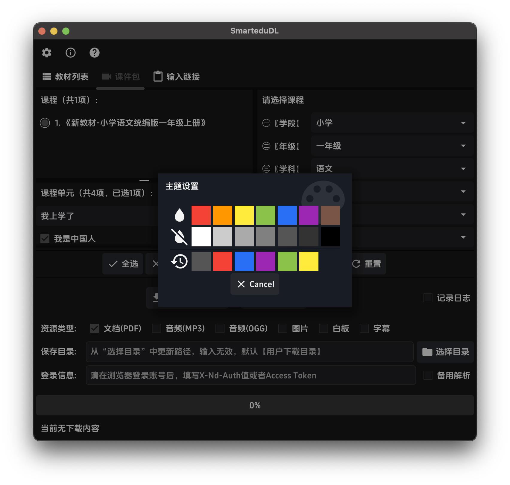 | 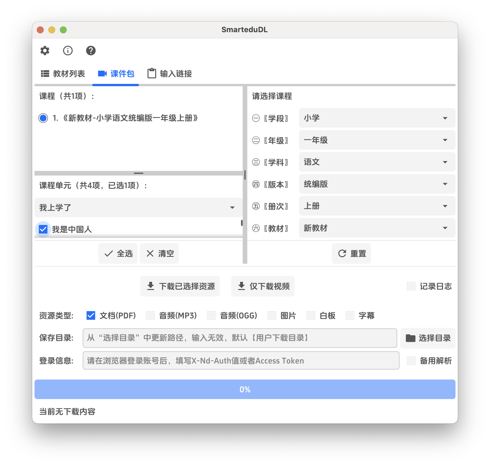 |
| macos   | 输入链接 | 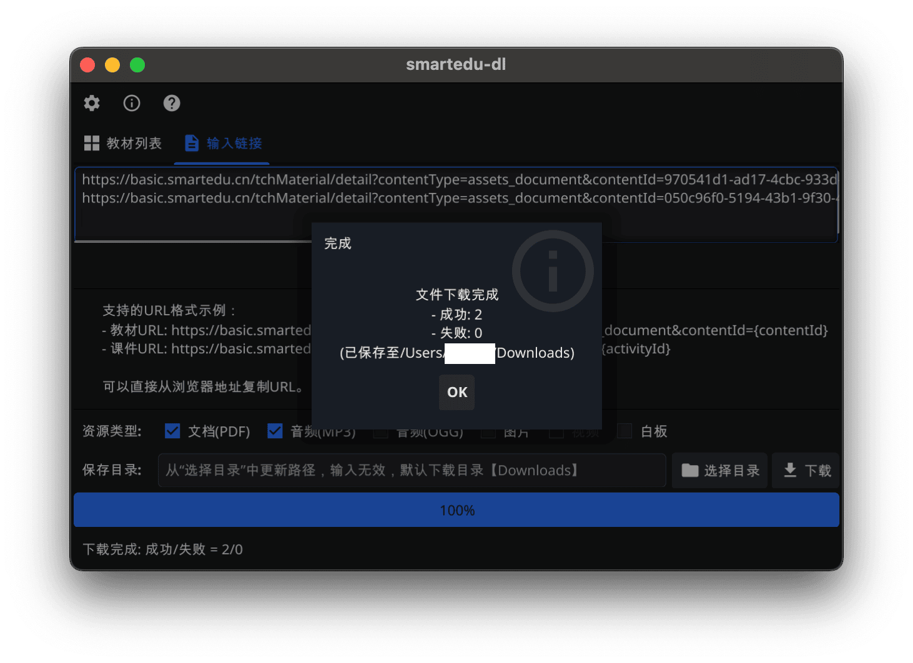 | 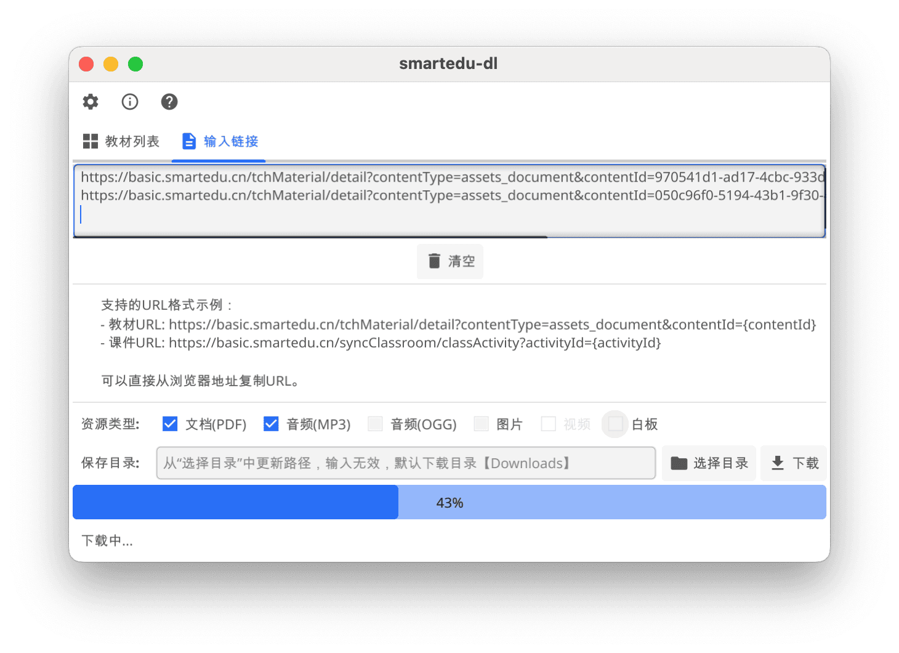 |
|         | 教材列表 | 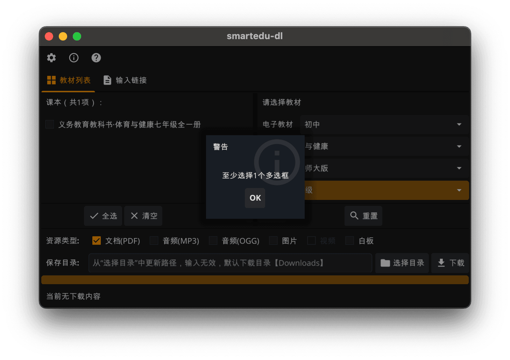 | 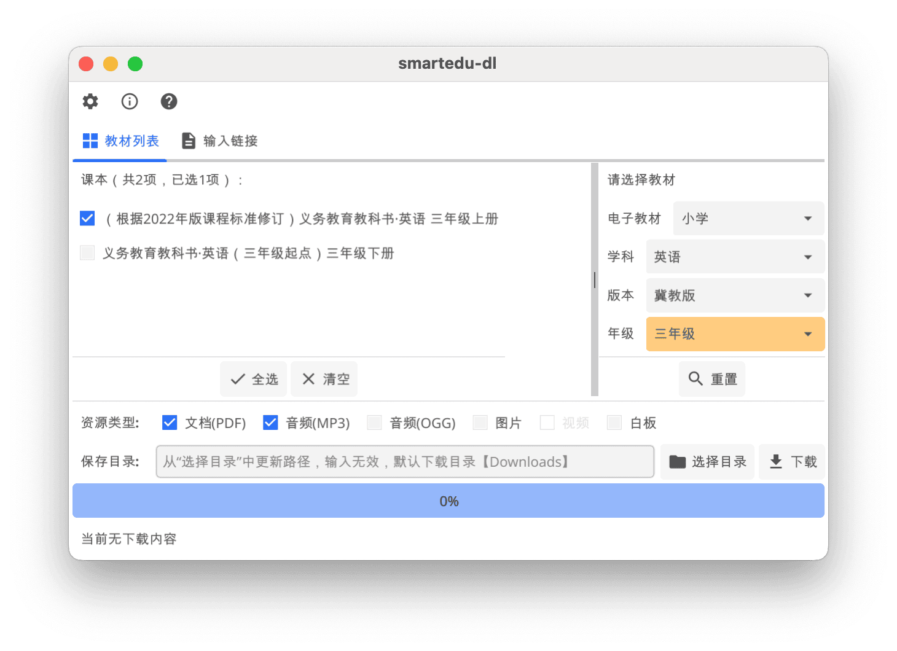 |
|         |          |                            |                            |
| windows |          | 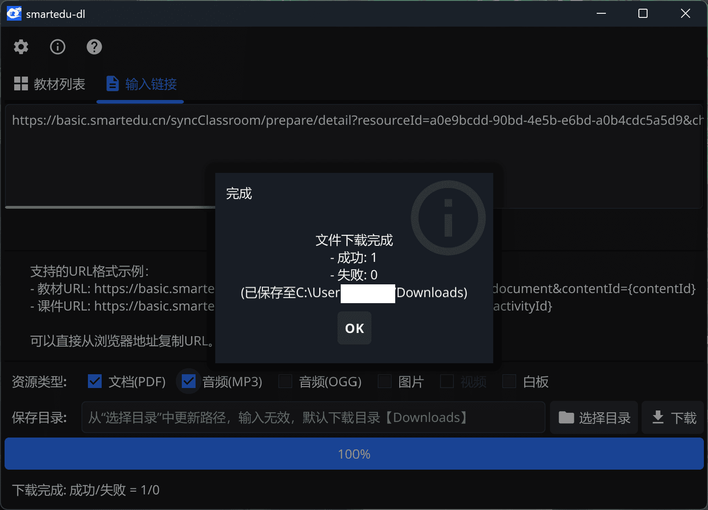   | 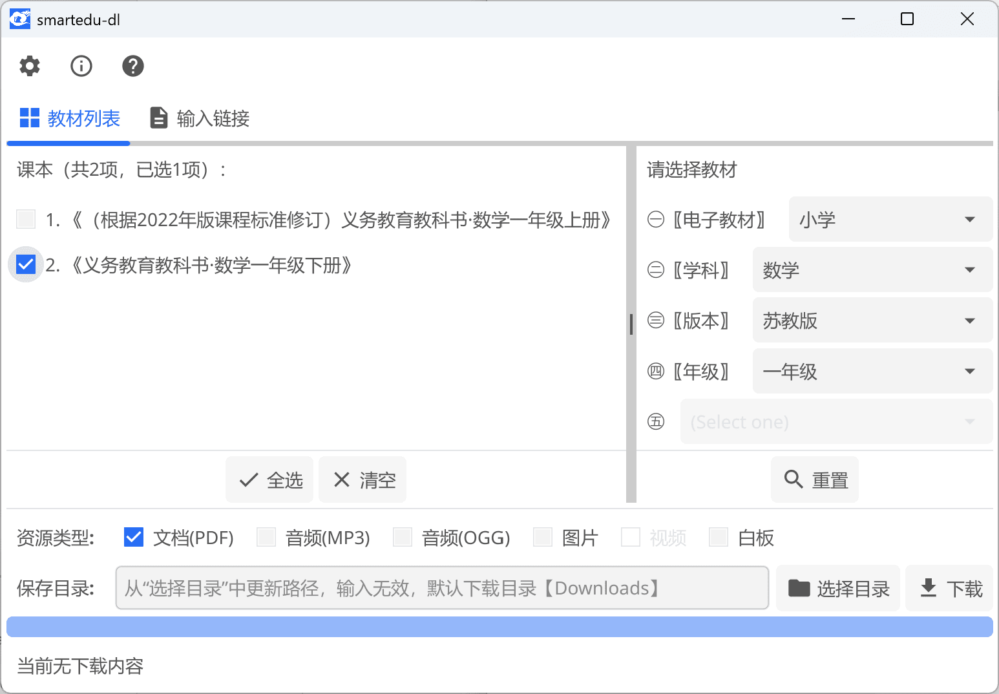   |
|         |          |                            |                            |
| linux   |          | 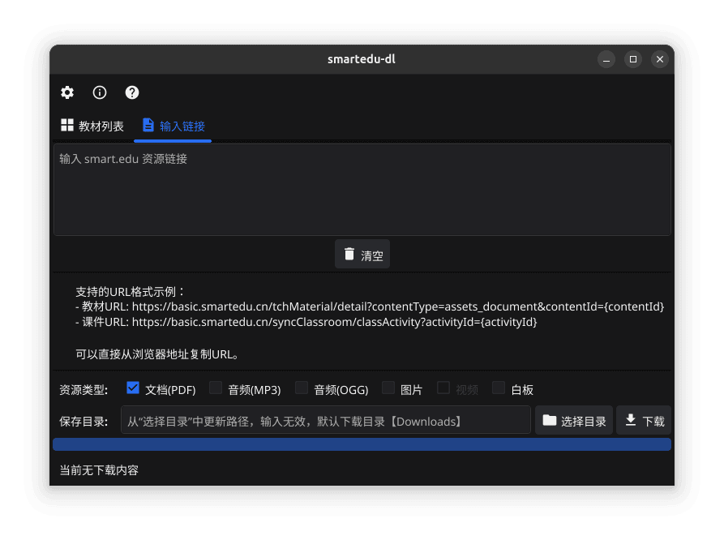 | 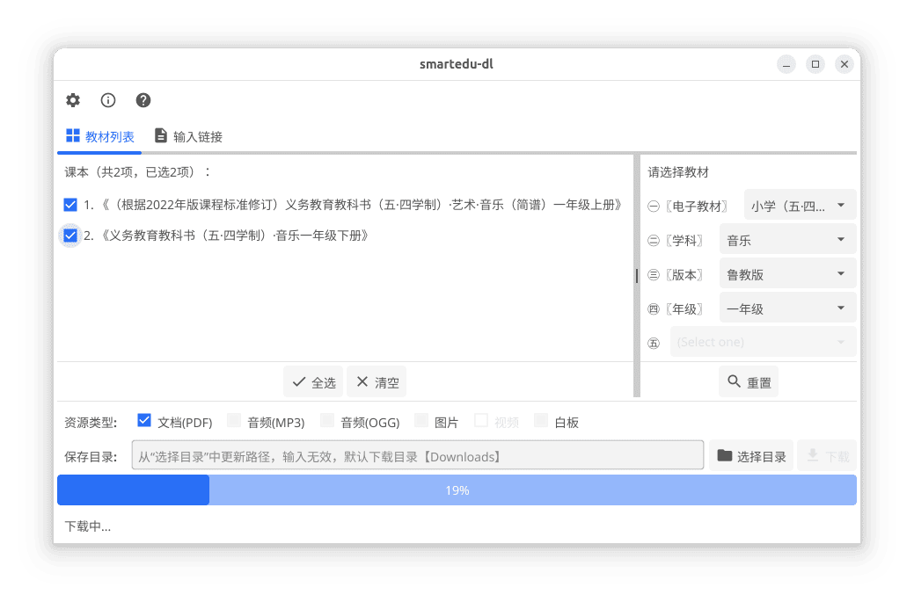 |
|         |          |                            |                            |
| 浏览器脚本  | （仅教材）   |                     |  |

### ⚡️ 更新

- [更新记录](CHANGELOG.md)

## 🚨 备注

### 配置登录信息

如果下载教材不是最新版，需要配置登录信息，找到 **X-ND-AUTH** 字段。

大致步骤：

1. 浏览器打开：<https://basic.smartedu.cn/tchMaterial>
2. 点击其中一本教材
3. 弹出新的页面中选择登录
4. 登录后重新打开教材页面，鼠标右键菜单中选择 **检查**（Inspect）/或者 `F12` 打开开发者工具 （DevTools）.
5. 之后步骤如下图，找到 **X-ND-AUTH** 字段
    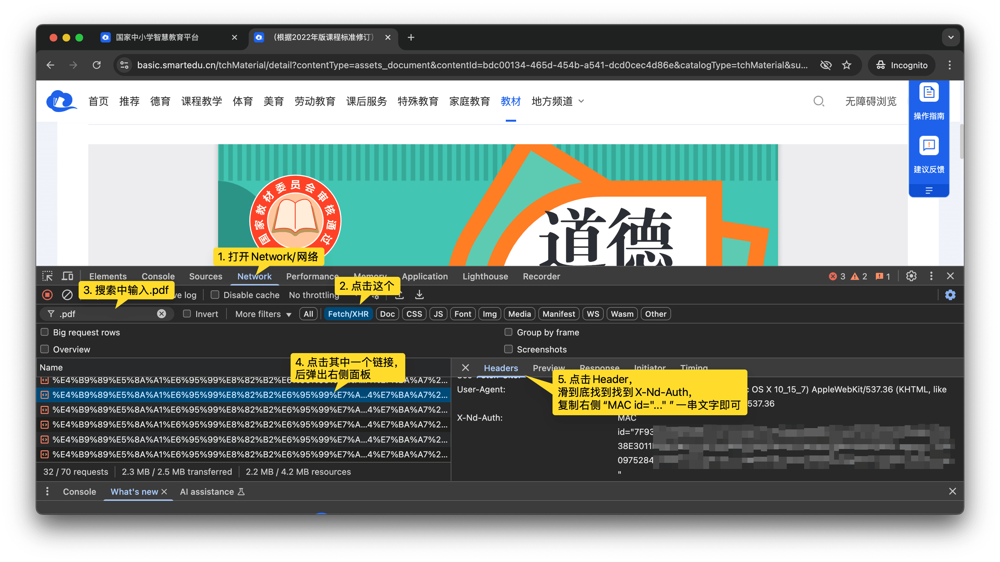
6. 图形界面在 **登录信息** 框中填入。

或者使用如下 javascript 代码获取`Access Token`（等同 X-ND-AUTH 中 `MAC id` 的值）

```javascript
// 来自 https://github.com/happycola233/tchMaterial-parser?tab=readme-ov-file#2-设置-access-token

(function () {
  const authKey = Object.keys(localStorage).find((key) => key.startsWith("ND_UC_AUTH"));
  if (!authKey) {
    console.error("未找到 Access Token，请确保已登录！");
    return;
  }
  const tokenData = JSON.parse(localStorage.getItem(authKey));
  const accessToken = JSON.parse(tokenData.value).access_token;
  console.log("%cAccess Token: ", "color: green; font-weight: bold", accessToken);
})();
```

其中 *ND_UC_AUTH* 完整取值为`ND_UC_AUTH-{sdpAppId}&ncet-xedu&token`

```javascript
// 打开页面 https://auth.smartedu.cn/uias/login
(document.documentElement.outerHTML.match(/sdpAppId: "([\da-fA-F\-]+)"/) || [])[1];
```

获取accessToken后，也可以通过拼接地址手动下载，拼接规则：`<文件地址>?accessToken=<accessToken的值>`

### Mac ARM芯片（M1等）

单独配置（**推荐**）

```shell
xattr -rd com.apple.quarantine /Applications/应用名.app
```

或者，开启任何来源（Anywhere）：

1. 终端命令行输入
```shell
sudo spctl --master-disable
# 恢复默认
# sudo spctl --master-enable
```

2. 打开 “系统设置”，进入 “隐私与安全性”> “安全性”，选择 “任何来源” 选项。
  （System Settings -> Priversy & Security -> Security -> Anywhere ）

## 👷 开发

```shell
# go语言开发环境
# 镜像
# export GOPROXY=https://goproxy.cn/,direct

# 更新依赖
# go get go@latest
# go get -u

# 执行
go mod tidy
go run main.go

# 参数：debug打印调试信息；local优先使用本地数据文件
go run main.go --debug --local
```

## 🌐 相关项目

- 类似项目
  - [happycola233/tchMaterial-parser](https://github.com/happycola233/tchMaterial-parser)
  - [52beijixing/smartedu-download](https://github.com/52beijixing/smartedu-download)
  - 智慧教育平台电子教材下载器
    - <https://www.52pojie.cn/thread-2036716-1-1.html>
    - <https://www.52pojie.cn/thread-1891126-1-1.html>
  - [cjhdevact/FlyEduDownloader](https://github.com/cjhdevact/FlyEduDownloader)

- 图标：修改自<https://www.smartedu.cn/>
