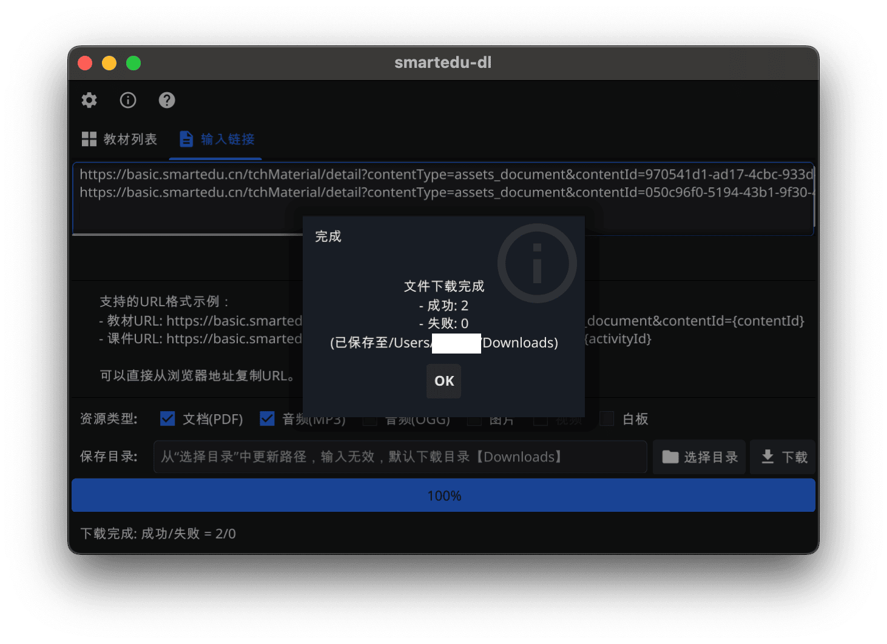
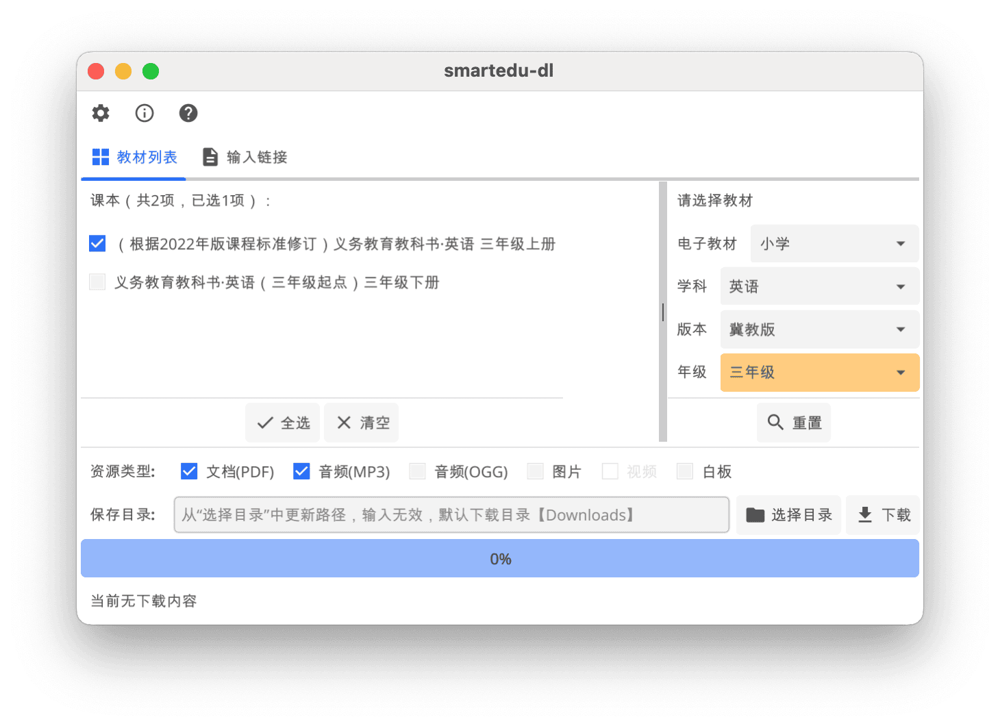

# smartedu-dl (`go`)


> 智慧教育平台资源下载工具（`go`实现版，基于 fyne 框架 GUI 版本）

## 📝 功能说明

主要支持`smartedu.cn`教材、课件（PDF 格式）下载存储。

### 🖥️ 截图

> 仅供参考，不一定是最新版界面。

| 平台    | 页面     | 暗黑                       | 明亮                        |
| ------- | -------- | -------------------------- | --------------------------- |
|         | 课程包 |  |  |
| macos   | 输入链接 |  |  |
|         | 教材列表 |  |  |
|         |          |                            |
| windows |          |    |    |
|         |          |                            |
| linux   |          |  |  |

### ⚡️ 更新

- [x] 链接输入列表下载(`v0.1.x`)
- [x] 教材查询列表下载(`v0.2.x`) 【推荐版本】
  - `v0.2.0` ~ `v0.2.6`
    - 支持登录信息配置（devtools/network选择pdf文件找到Request Headers中`x-nd-auth`参数）
    - 增加日志统计（结果保存在`log-smartedudl.txt`）
    - 增加备用解析链接
    - 已知问题：
      - 部分音频下载可能失败（包括已配置登录信息）；
      - 非登录状态部分资源可能下载失败或下载的是旧版教材；
      - 新增备用解析，可能导致下载同一个下载多个对应PDF（可能不完全相同）。
  - `v0.2.7`
    - 新增课程包Tab页面
    - 支持视频下载（需要登录，单线程，保存格式`.ts`文件，用户可用**FFmpeg**等工具将之转化成其他视频格式）
    - 登录信息可仅配置Access Token
    - 修改字体为“抖音美好体” 来自[:link:](https://github.com/bytedance/fonts)
  - `v0.2.8`/`v0.2.9`
    - 修复“精品课程”解析
  - `v0.2.10`
    - 修复保存文件名（去除标题中特殊字符）
  - `v0.2.11`
    - 修正保存路径问题
    - 下载资源根据URL路径去除重复
  - `v0.2.12`
    - 修复非加密视频下载错误
    - 支持直接输入资源链接
    - 支持多线程下载视频
  - `v0.2.13`
    - 修复同名资源下载错误
    - 修订提示文字
  - `v0.2.14`
    - 修复未选择资源类型时出现下载按钮禁用问题
    - 新增登录信息保存和预加载（或使用环境变量`SMARTEDU_TOKEN`）
    - 新增中小学语文示范诵读库标签页面

## 🚨 备注

### 配置登录信息

如果下载教材不是最新版，需要配置登录信息，找到 **X-ND-AUTH** 字段。

大致步骤：

1. 浏览器打开：<https://basic.smartedu.cn/tchMaterial>
2. 点击其中一本教材
3. 弹出新的页面中选择登录
4. 登录后重新打开教材页面，鼠标右键菜单中选择 **检查**（Inspect）/或者 `F12` 打开开发者工具 （DevTools）.
5. 之后步骤如下图，找到 **X-ND-AUTH** 字段
    
6. 图形界面在 **登录信息** 框中填入。

或者使用如下 javascript 代码获取`Access Token`（等同 X-ND-AUTH 中 `MAC id` 的值）

```javascript
// 来自 https://github.com/happycola233/tchMaterial-parser?tab=readme-ov-file#2-设置-access-token

(function () {
  const authKey = Object.keys(localStorage).find((key) => key.startsWith("ND_UC_AUTH"));
  if (!authKey) {
    console.error("未找到 Access Token，请确保已登录！");
    return;
  }
  const tokenData = JSON.parse(localStorage.getItem(authKey));
  const accessToken = JSON.parse(tokenData.value).access_token;
  console.log("%cAccess Token: ", "color: green; font-weight: bold", accessToken);
})();
```

其中 ND_UC_AUTH 完整取值为`ND_UC_AUTH-{sdpAppId}&ncet-xedu&token`

```javascript
// 打开页面 https://auth.smartedu.cn/uias/login
(document.documentElement.outerHTML.match(/sdpAppId: "([\da-fA-F\-]+)"/) || [])[1];
```

### Mac ARM芯片（M1-M4）

单独配置
```shell
sudo xattr -rd com.apple.quarantine /Applications/应用名.app
```

或者，开启任何来源（Anywhere）：

1. 终端命令行输入
```shell
sudo spctl --master-disable
# 恢复默认
# sudo spctl --master-enable
```

2. 打开 “系统设置”，进入 “隐私与安全性”> “安全性”，选择 “任何来源” 选项。
  （System Settings -> Priversy & Security -> Security -> Anywhere ）

## 👷 开发

```shell
# go语言开发环境

go mod tidy
go run main.go

# 参数：debug打印调试信息；local优先使用本地数据文件
go run main.go --debug --local
```

## 🌐 相关项目

- 旧版（python）
  - [hantang/smartedu-dl](https://github.com/hantang/smartedu-dl)

- 类似项目
  - [happycola233/tchMaterial-parser](https://github.com/happycola233/tchMaterial-parser)
  - [52beijixing/smartedu-download](https://github.com/52beijixing/smartedu-download)
  - 智慧教育平台电子教材下载器 <https://www.52pojie.cn/thread-1891126-1-1.html>
  - [cjhdevact/FlyEduDownloader](https://github.com/cjhdevact/FlyEduDownloader)

- 图标：修改自<https://www.smartedu.cn/>
